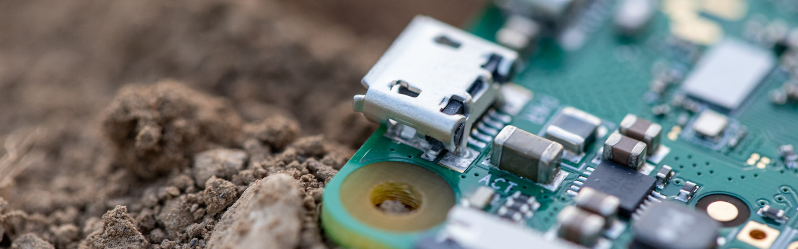

---

title: TL;DR

---

Hi! I'm Aster, [pronouns __she/her__](https://pronouns.org/she-her). I'm a seasoned full-stack engineer with over ten years experience. I'm currently a Senior Software Engineer at Plume, working to weave trans equity into the fabric of healthcare technology. My journey's taken me from places like The New York Times and Medium to where I am now, passionately working remotely (and loving it!).

In my world, tech is more than just code; it's a path to making things fairer for everyone. I've got a knack for full-stack web development and a soft spot for creating slick infrastructure pipelines – think Cloudflare, Fastly, AWS Lambda, you name it. And yes, I'm that person who gets excited about continuous deployment. I'm currently studying embedded engineering in my spare time, and thoroughly enjoy building systems that help people in a tangible way.

But hey, life's not all about tech, right? When I'm not coding, you might find me in my garden, woodworking, or plunking out a melody on my MIDI boards. I believe in balancing the digital with the down-to-earth, which helps keeps me grounded.

So, that's a bit about me. I'm here to make a mark, not just in tech, but in how we think about equity and accessibility in this ever-evolving digital age. Let's connect and make some waves!

- [Work Experience](work/index)
- [Volunteer Experience](volunteer/index)
- [Side Projects](side_projects/index)
	- [Woodworking](side_projects/woodworking/index)
	- [Embedded Engineering](side_projects/embedded_eng/index)
	- [Homesteading](side_projects/homestead/index)
	- [Spoken Language Learning](side_projects/spoken_language/index)
	- [Queer Theory](side_projects/queer/index.md)